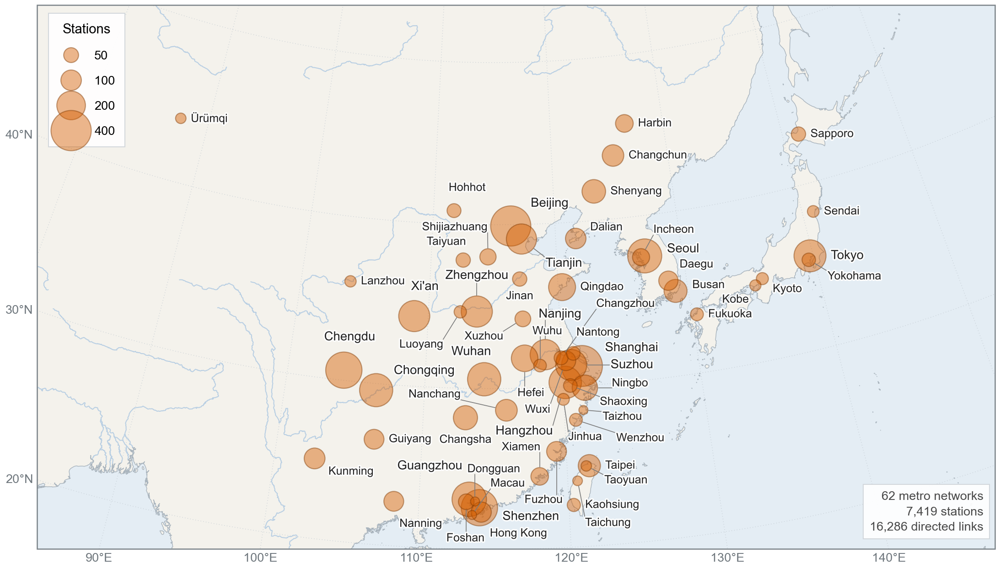
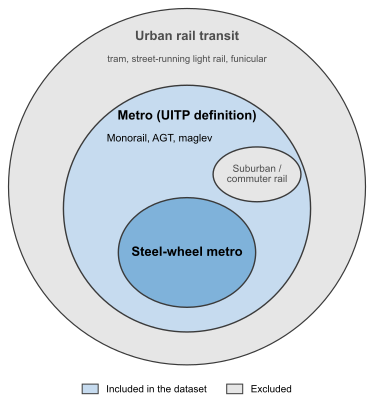

<h1 align="center">East Asian metro dataset</h1>

<p align="center">
  东亚地铁数据库 / 東亞地鐵數據庫<br>
  東アジアの地下鉄データセット<br>
  동아시아 지하철 데이터셋
</p>



*Figure 1. Location of the 62 metro networks in the dataset. Each circle marks one network at the mean coordinate of its stations, with its area proportional to the number of stations.*

## Summary

This repository provides metro network data for 62 East Asian cities in two graph representations, namely the L-space and P-space[^vonFerber2009]. Both representations use stations as nodes. In L-space, a link connects two stations that are consecutive stops on at least one route. In P-space, a link connects two stations served by at least one common route, representing travel without a transfer, regardless of the number of intermediate stops.

The dataset accompanies the manuscript Accessibility Analysis of East Asian Metro Systems by Rajat Verma, Hanyu Cheng, and Oded Cats. It is published to support reuse of the data and reproduction of the study’s analyses.

## Inclusion criteria and scope
In this dataset, **East Asia** refers to the “Eastern Asia” subregion (code 030) in the United Nations M49 geographical classification[^UNM49]. Within this region, we consider cities with **urban rail transit**, defined here as rail-based public passenger transport serving urban areas[^Vuchic2007][^MegnaBracciali2022]. Where sufficient data are available, we construct a metro network for each city using only lines that meet both of the following criteria:

### Criterion 1: Functional and operational requirements
In Europe and United States, definitions of metro generally involves the serving area served, right of way, service frequency and passenger capacity[^APTA2019][^EU2018]. In East Asia, however, legal and operational classifications vary across countries and regions[^GBT44413][^MOTUrbanRail2018][^KoreaUrbanRailroadAct][^KoreaRailroadConstructionAct][^MLITYardstick]. To ensure a consistent approach across the study area, we apply a common technical criterion based on the broad statistical definition of the International Association of Public Transport (UITP), alongside jurisdiction-specific rules for defining network boundaries.

Under this criterion, eligible lines must provide guided, electrically powered urban passenger services on an exclusive right of way, using trains comprising at least two cars and having a total capacity of at least 100 passengers per train[^UITP2025].

Adopting this broad definition allows us to include technologies beyond conventional steel-wheel metro. These account for 22 of the 418 included lines across 13 cities:

- Straddle monorail (7) : Seven lines in Chongqing (Lines 2 and 3, with an additional branch of Line 3), Wuhu (Lines 1 and 2), Daegu (Line 3) and Tokyo (Tokyo Monorail).
- Rubber-tyred automated guideway transit and people movers (10): Yurikamome and the Nippori–Toneri Liner in Tokyo, all three Macau lines, the Wenhu Line in Taipei, Busan Line 4, the Sillim Line in Seoul, and the APM lines in Guangzhou and Shanghai.
- Rubber-tyred metro with a central guide rail (3): All three Sapporo subway lines.
- Medium- and low-speed maglev (2): Beijing Line S1 and the Changsha Maglev Express.

Restricting the dataset to conventional steel-wheel metro would omit functionally comparable services. Ten city networks would be represented only partially, while the Macau, Sapporo and Wuhu networks would be excluded entirely. This adds another reason for the adoption of a boarder concept.

For each city, we review the lines within its designated urban rail transit system. Included lines must meet UITP’s metro criteria, namely "guided, electrically powered urban passenger services operating on an exclusive right of way, with trains of at least two cars and a total capacity of at least 100 passengers."[^UITP2025]

### Criterion 2: Exclusion of suburban and commuter rail
Functional requirements alone are insufficient to define the entry requirement thoroughly, as suburban and commuter rail services may also meet them, which is of particular relevance in Tokyo and Seoul. The second criterion therefore uses the relevant legislation and official classifications in each jurisdiction to identify the urban rail systems included in the dataset, with line-level boundaries established from official planning and operating records. Suburban and commuter rail are excluded, consistent with definition of metro concept defined by UITP[^UITP2025] and the European and North American datasets, which omit services such as the Paris RER and Berlin S-Bahn[^Vijlbrief2022a][^Vijlbrief2022b]. Including these services only in East Asia would introduce inconsistent network coverage and could exaggerate the observed regional differences. 

In short, **the dataset use a boder defition to include a few systems that are not conventional steel-wheel metro systems, but explicitly excludes commuter and suburban rail**. The diagram below summarises its scope.



*Figure 2. Scope of the dataset within urban rail transit. Blue areas indicate included systems while grey areas indicate exclusions.*

The full selection procedure, including network boundaries and exclusions, is documented in the [line-level inclusion rules](docs/inclusion_rule.md).

## Network construction

### Essential input
Regardless of the data source, constructing L-space and P-space representations of metro networks that incorporate service information for access-graph analysis requires at least four types of input:

1. **Stations:** The set of stations forming each network, identified by their names and geographical coordinates. Each station is represented as a node in both graph representations.
2. **Service routes:** The ordered sequence of stations served by each line and direction, including branches, short-turn services and distinct operating patterns. These determine the connections between consecutive stations in L-space and the station pairs reachable without a transfer in P-space.
3. **In-vehicle times:** The travel time between consecutive stations along each route, including the dwell time at the downstream station. These values are assigned to L-space links and used to calculate the in-vehicle time of longer journeys.
4. **Service frequencies:** The number of services operating along each route and direction, including variations across sections of a line. These determine the frequency of direct connections between station pairs in P-space, from which expected waiting times are derived.

Together, these four components provide the basis for constructing both graph representations. Although in-vehicle time, frequency and waiting time are defined consistently across all 62 networks, the methods used to obtain them depend on the available source data. In the simplest case, a GTFS feed can provide all the necessary inputs. Otherwise, complete train timetables must be compiled by combining supplementary data from multiple sources.

The modelling assumptions shared by every source are stated in [Common modelling assumptions](#common-modelling-assumptions), and the precise definitions of the graph representations and their attributes are given in [The construction of L-space and P-space](#the-construction-of-l-space-and-p-space).

### Data sources

The station, route, in-vehicle time and frequency information described above was obtained through five data collection routes. These differ in the information supplied directly and the inputs that require estimation or supplementation.

*Table 1. Data sources, network coverage, available information and source-specific limitations. Numbers in parentheses indicate the number of networks.*

| Data source | Network coverage | Available source data | Limitations and supplementary inputs |
|---|---|---|---|
| Amap subway service[^Amap2025] | 45 mainland Chinese cities, Hong Kong and Macau (47) | Lines, ordered stations with coordinates and transfer flags, and first- and last-train departure times by station and direction | No individual trip timetables or headways; in-vehicle times are estimated and frequency information is obtained separately |
| Operator GTFS feeds, Japan | Tokyo (four operators)[^ODPT2025], Yokohama[^Yokohama2024], Kyoto[^Kyoto2025] and Sapporo[^Sapporo2020] (4) | Stops, trips, stop times and service calendars | No additional inputs required for the core network construction |
| Operator timetables converted to GTFS, Japan | Sendai[^Sendai2023], Kobe[^Kobe2025] and Fukuoka[^Fukuoka2025] (3) | Station-level departure timetables, converted into trip and stop-time records | Kobe's station set is obtained separately from Vijlbrief et al.[^Vijlbrief2022a] |
| KTDB national GTFS, South Korea[^KTDB2025] | Seoul, Busan, Daegu and Incheon (4) | Stops, trips and stop times from the March 2023 dataset | Stations opened in 2024 and 2025 are absent, and Seoul Line 2 loop services are incompletely represented |
| TDX Rail/Metro API, Taiwan[^TDX2026] | Taipei, Taoyuan, Taichung and Kaohsiung (4) | Stations, station sequences by line, inter-station running and dwell times, and headway bands by service pattern and day type | No individual trip records; frequencies are derived from the supplied headway bands |

The following subsections define the common graph attributes and explain how each source was processed into L-space and P-space, including the treatment of missing or incomplete information. Network-specific details are summarised in the [per-network construction table](#per-network-construction-table), followed by guidance on [using the files](#properties-to-know-before-computing-with-the-files) and the [extent to which the construction can be reproduced](#reproducibility).

The supporting documentation provides [field definitions](docs/data_dictionary.md), [frequency sources and provenance](docs/frequency_sources.md), and a [record of corrections to the published networks](docs/dataset_record.md).

### Common modelling assumptions

The target reference date for network extent and station coverage is 24 September 2025. Service statements are admitted only where published on or before 30 September 2025, and later statements are recorded but not applied. Where the available sources refer to a different period, the corresponding exceptions and their implications are documented in the source-specific construction subsections below.

Network boundaries follow the [inclusion criteria](#inclusion-criteria-and-scope) defined above. Through-running services are represented only within the boundary of the designated system. After applying the inclusion criteria, only the largest connected component of each city network is retained, excluding sections that were disconnected from the main network at the reference date. In practice, this affects only Foshan in China, where the nine-station northern section of Line 3 was disconnected from the rest of the network.

Service calculations use weekday conditions. For GTFS-based networks, weekday trips are selected using Monday service, with Monday and Tuesday used in the Korean rebuild. Other sources use published weekday service information. Frequencies are averaged over a common window from 05:00 to 24:00, using a fixed denominator of 19 hours even where the operating span is shorter. The resulting values therefore describe average weekday service over the same observation window.

### The construction of L-space and P-space

Both representations are built from the same sets of stations and routes and differ only in which station pairs they connect[^vonFerber2009]. The terminology and mathematical notation are the same as those used in our paper. Let $V$ be the set of stations of a network. A station $v_i \in V$ is a node with an integer `id` from 0 to $|V|-1$ in list order, a `name` as delivered by the source, and `lat`, `lon` in WGS-84 decimal degrees. Let $R$ be the set of route records, the rows of `data/route_information.csv` keyed by `city` and `route_id`. A route record is one line, or one branch, short-turn section or loop direction of a line where the source lists it separately, with an ordered station sequence in each direction.

**L-space** $G_L=(V,E_L)$ is directed, with a link $(v_i,v_j)$ between stations served consecutively by at least one route record in that direction, and a corresponding link $(v_j,v_i)$ in the opposite direction. Its service attribute is the in-vehicle time of the link. **P-space** $G_P=(V,E_P)$ is directed, and it is the graph the paper writes as $G(V,E)$. A link $e_{ij}=(v_i,v_j)$ exists when a passenger can travel from $v_i$ to $v_j$ on one route record without a transfer. The [P-space JSON files](data/p-space/) store a separate entry $(v_i,v_j,r)$ for each route record $r$ whose trains stop at $v_i$ and later at $v_j$ in the same direction. Its service attributes are the frequency of each route record over the pair and the waiting time derived from their sum. In-vehicle time therefore belongs to L-space and frequency to P-space, and each attribute is defined below under the representation that stores it.

#### From route records to links

For a route record $r$ with ordered station sequence $s_1,\dots,s_m$ in direction $\delta$, L-space receives the links $(s_k,s_{k+1})$ for $k<m$ and P-space receives one record for every ordered pair $(s_k,s_l)$ with $k<l$. The following additional rules address cases not fully captured by a simple station sequence.

- A loop line, which the Amap map holds as one line, is held here as two route records, one per running direction, each with the full circle, so every ordered pair is reached both ways round (Beijing Lines 2 and 10, Chengdu Line 7, the Chongqing Loop Line, Guangzhou Line 11, Harbin Line 3, Shanghai Line 4, Xi'an Line 8, Zhengzhou Line 5). For the Tokyo Oedo Line, which its feed describes trip by trip, each ordered pair is counted once per trip and the shorter way round only.
- Each branch, short-turn service or separately listed section of a line has its own route record. This ensures that P-space connects two stations only when passengers can travel between them without changing trains. For example, Shanghai Lines 5, 10 and 11 each have two route records to represent their branches.
- A station pair is included only when a train stops at both stations, and services are truncated at the designated system boundary. In Japanese and Korean networks, cross-line pairs are included when the source lists a through service as one trip, as in Kobe. Separately listed trips are never joined, so Fukuoka’s through service at Nakasu-Kawabata appears as two rides with a transfer in the files. Amap does not provide data on cross-line through services, so these services are not represented in the dataset.

Both spaces are stored as directed graphs because the service they describe is directed as the two directions of a link may differ in in-vehicle time, and the two directions of a pair in frequency. The data dictionary quantifies how often they do.

#### L-space links and in-vehicle time

The in-vehicle time $t^{\text{in-veh}}_{ij}$ of a directed L-space link $(v_i,v_j)$ is the time between the departure of a train from $v_i$ and its departure from the next station $v_j$, in seconds. It therefore contains the running time from $v_i$ to $v_j$ and the dwell at $v_j$. At the terminus of a trip the arrival time at $v_j$ is used, because there is no departure. The convention is identical on every network. It is the quantity that enters generalised travel time, because a passenger who rides through $v_j$ spends the dwell on board. The in-vehicle time of a longer journey is the sum of the link times along the route ([Travel time from the files](#travel-time-from-the-files)).

The source decides how $t^{\text{in-veh}}_{ij}$ is obtained, and the source-specific subsections below give each method in full.

| Source | Networks | Links | How `duration_avg` is obtained |
|---|---|---|---|
| Amap | 47 | 13,658 | first- and last-train progression along the line, whole minutes |
| Operator GTFS and converted timetables, Japan | 7 | 1,002 | mean over weekday trips of departure at $v_j$ minus departure at $v_i$ |
| KTDB GTFS, Korea | 4 | 1,218 | the same, on the March 2023 feed |
| TDX, Taiwan | 4 | 408 | run time plus stop time at $v_j$ from `S2STravelTime`, or matrix differences |

A link carries

| Symbol | File field | Unit | Meaning |
|---|---|---|---|
| $t^{\text{in-veh}}_{ij}$ | `duration_avg` | seconds | in-vehicle time from $v_i$ to $v_j$, measured departure to departure, so run time plus the dwell at $v_j$ |
| $R_{ij}$ | `route_I_counts` | route ids | the route records for which $(v_i,v_j)$ is a consecutive pair. The numeric values inside the dictionary are a placeholder, only the keys carry information |
| | `d`, `n_vehicles`, `shape_id`, `headsign`, `direction_id` | | placeholders inherited from the file schema of Vijlbrief et al.[^Vijlbrief2022a] `d` equals ten times `duration_avg` and is not a length. Compute distances from the coordinates |
| | `duration_source`, `duration_n_trips`, `v1_duration_avg` | | present on a link whose time was computed or re-timed after the 2025 compilation: how, from how many trips, and the 2025 value it replaced |

#### P-space records, frequency and waiting time

The frequency $f^{r,\delta}_{ij}$ of route record $r$ in direction $\delta$ over the ordered pair $(v_i,v_j)$ is the number of weekday services of $r$ that call at $v_i$ and later at $v_j$ within the 05:00 to 24:00 window, divided by 19 hours, in trains per hour. The window, the weekday selection and the fixed denominator are those of the common modelling assumptions above. The waiting time is the expected wait of a passenger arriving at random, half the combined headway of all route records serving the pair,

$$w_{ij} = \frac{30}{\sum_{r,\delta} f^{r,\delta}_{ij}} \text{ minutes},$$

and this identity holds on every record of every P-space file. No operator publishes a waiting time. The dataset derives it.

As with in-vehicle time, the definition is common to every network and the source decides how the count is obtained.

| Source | Networks | Records | How `veh` is obtained |
|---|---|---|---|
| Amap | 47 | 189,958 | published interval statements integrated over the service window of each link, carried from links to pairs as the bottleneck along the route |
| Operator GTFS and converted timetables, Japan | 7 | 10,600 | count of the weekday trips that call at $v_i$ and later at $v_j$ |
| KTDB GTFS, Korea | 4 | 19,576 | the same, on the March 2023 feed |
| TDX, Taiwan | 4 | 4,388 | weekday headway bands per service pattern integrated over the window |

A record carries

| Symbol | File field | Unit | Meaning |
|---|---|---|---|
| $f_{ij}^{r,\delta}$ | `veh[r][δ]` | trains per hour | weekday service frequency of route $r$ in direction $\delta\in\{0,1\}$ over the ordered pair $(v_i,v_j)$, computed over 05:00 to 24:00 |
| $w_{ij}$ | `avg_wait` | minutes | expected waiting time at $v_i$ for a direct service to $v_j$, $w_{ij} = 30 / \sum_{r,\delta} f_{ij}^{r,\delta}$, half the combined headway |
| | `wait_source` | | the provenance label of the frequency, followed by the URLs and dates of the statements or the feed it was read from |
| | `edge_color`, `v1_avg_wait` | | the line colour where the source gives one, and the waiting time of the 2025 compilation where it changed |

#### Loading the files

Files are NetworkX node-link JSON. With networkx 3.4 or later use `nx.node_link_graph(data, edges="links")`, with earlier versions `nx.node_link_graph(data)`. The files declare `multigraph: false`, and 32 of the 62 P-space files hold more than one record for some ordered pairs (one record per route record serving the pair). A node-link loader keeps the last record it meets. [Properties to know before computing with the files](#properties-to-know-before-computing-with-the-files) says how to combine them.

### Building the Amap networks (45 mainland Chinese cities, Hong Kong and Macau)

#### What the Amap subway service provides, and why it is not GTFS

A GTFS feed describes a service as a set of trips, each with a stop sequence and a departure time at every stop, valid on the days of a calendar. Every network attribute is then a count or an average over scheduled trips, which is how the Japanese, Korean and Taiwanese networks of this dataset, and the European and North American reference networks of Vijlbrief et al.[^Vijlbrief2022a][^Vijlbrief2022b], were built. No comparable feed exists for the Chinese networks. What Amap publishes for each city is an interactive subway map (`https://map.amap.com/subway/`, one map per city, addressed by the city's administrative code, 1100 for Beijing, 3100 for Shanghai, 8100 for Hong Kong, 8200 for Macau), and the information behind that map is of two kinds:

- the network: the lines of the city, each with its ordered stations, and for each station its name, its position in the GCJ-02 datum that Chinese map services use, and whether it is an interchange, with branches, short-turn patterns and loop lines shown as the operator runs them,
- the service span: for every station and every line direction serving it, the departure time of the first and of the last train of the day, to the minute.


There are no trips, no intermediate departure times and no headways. Three consequences follow, and they organise everything said below about the Chinese networks. The topology comes directly from the service. The in-vehicle time of a link has to be inferred from the progression of the first and last train times along the line (the in-vehicle time subsection of this part). The frequency has to come from elsewhere, namely from the interval statements that operators publish, and failing that from the interval bands of Amap's separate bus-line information service (the frequency subsection of this part).

#### Stations and route records

**Compilation, July to September 2025.** For each of the 47 networks the station and line listing of the Amap subway map was retrieved as a table with one row per station and line (station name, line name, order along the line, position). Coordinates were converted from GCJ-02 to WGS-84 with the standard inverse of the GCJ-02 transformation, the same conversion that Wang et al.[^Wang2026] validated for CPTOND-2025 against Baidu Maps at a mean deviation of 35 m. Stations with the same name within a city were merged into one node, so an interchange, which Amap stores as one point per line, became a single station, and a station served by two or more lines is a transfer station. Each line and direction became a route record with its ordered station sequence, with branches, short-turn sections and inner and outer loops kept as separate records where Amap lists them separately. Nodes were numbered 0 to $|V|-1$. The first and last train times provided the in-vehicle times (next subsection). The compilation reflects the networks as they stood on 24 September 2025.

#### In-vehicle time: the first- and last-train progression

Amap publishes, for every station and line direction, the departure time of the first and of the last train of the day, to the minute. Along a line the first train is, with few exceptions, the same physical train observed at successive stations, and so is the last train. The difference between its published departure times at two consecutive stations is therefore the running time plus the dwell at the downstream station, exactly the quantity defined above. For a directed consecutive pair $(v_i,v_j)$ on route record $r$:

$$\Delta^{\text{first}}_{ij} = T^{\text{first}}_r(v_j) - T^{\text{first}}_r(v_i), \qquad \Delta^{\text{last}}_{ij} = T^{\text{last}}_r(v_j) - T^{\text{last}}_r(v_i),$$

where a last-train time after midnight is moved to the following service day before differencing, and a negative difference is discarded rather than wrapped around the clock. Each candidate is kept only if it passes a distance-aware plausibility screen,

$$0.75 \le \Delta \le \min\bigl(35,\ \max(6,\ 3 + 1.8\, d_{ij})\bigr) \text{ minutes},$$

with $d_{ij}$ the great-circle distance in kilometres, so that a long suburban segment is not rejected by a flat ceiling while a depot insertion or a short-turn, which produce a difference that belongs to no single train, is. The estimate is the median of the surviving candidates. Where both survive and agree within one minute the segment is marked high confidence, where only one survives medium confidence. Where neither survives, the value is borrowed from the reverse direction or a sibling pattern of the same line over the same station pair if one has direct evidence, and otherwise it comes from a distance model $t^{\text{in-veh}} = a + b\, d$ fitted by least squares to the trusted segments of the line (or of the city where a line has fewer than eight trusted segments), with $a$ clipped to 0.5 to 1.5 minutes and $b$ to 0.35 to 3.0 minutes per kilometre. On the Shanghai network, where the estimator was re-run in full in 2026 on an archived capture, 88.5 percent of the 1,152 directed segments rest on direct first- and last-train evidence and 11.5 percent on borrowing or the distance model. The published Chinese link times are these estimates rounded to whole minutes, and the rounding is visible in the data: 13,224 of the 13,658 Amap links, 96.8 percent, are exact multiples of 60 seconds, against 4.7 percent in Tokyo and 3.1 percent in Taipei.

The published values are those of the 2025 compilation, with three kinds of exception that `duration_source` marks on the link: links whose 2025 time implied a speed above 120 km/h were re-estimated with the same estimator on the 2026 capture (150 km/h is allowed on the 160 km/h express lines of Beijing, Chengdu and Guangzhou), links of the two added lines were estimated from the 2026 capture, and a link with no Amap evidence at all took the median speed of its route's plausible links. Together these are 88 of the 13,658 Amap links, in 11 networks. The 2026 estimator rounds to the half minute, so these links need not fall on a whole minute. The 2026 re-run of the estimator on the archived Shanghai capture reproduces the 2025 values at a median difference of 0.0 minutes over 484 matched segments, which is the evidence that the 2025 compilation used this method.

Two properties of the method should be kept in mind when using the Chinese in-vehicle times. First, the first and last trains run in the emptiest periods of the day, so the estimate is an off-peak running time and a lower bound on the typical in-vehicle time. On one Shanghai origin-destination pair checked against Amap's journey planner, five consecutive Line 1 segments sum to 11 minutes by this method against 13 minutes off-peak and 17 minutes in the peak hours by the planner. The bias is common to all Amap networks and largely cancels in comparisons among them, but not in comparisons with networks whose link times are all-day timetable averages. Second, both clock times are published to the minute, so a single segment carries roughly one minute of quantisation. The agreement of the first- and last-train differences measures consistency between two quantised readings, not accuracy. At network scale the quantisation is unbiased and averages out, so network-level indicators are far more robust than any single link.

#### Frequency and waiting time: published interval statements

Nothing in the Amap subway service gives a frequency, so for the 47 networks the frequencies were transcribed from published interval statements and converted to the same 19-hour convention. The full procedure, with every statement, URL and date, is `docs/frequency_sources.md`, and `data/route_frequency_sources.csv` gives the source of every route. In outline:

1. **Sources, in order of preference.** Three ranks. The operator's own interval table or station timetable comes first, then transcribed notices, whether from the operator's own channels or relayed by a government portal or press article and labelled as such, then the interval bands that Amap's bus-line information service returns per line and direction (undated). The bands are admitted only if they pass a five-part acceptance test against the notices and the China Association of Metros' reported minimum peak headway: the bands are rejected if the Amap peak is more than 30 seconds shorter than the city's reported minimum, if the patterns sum to less than half the 2025 constant, if a notice peak is more than 30 seconds shorter than the Amap peak, if a flat daytime band on a line of more than 15 stations has no confirming notice, or if the 2025 constant exceeds 1.6 times the Amap all-day value with no confirming notice. Each statement is one transcribed row with the line, section, day type, period, headway and the verbatim text, URL and dates.
2. **Admissibility.** The newest weekday statement dated on or before 30 September 2025. Later statements are kept for the record and not applied.
3. **From statements to a frequency.** For every directed L-space link of a route the service window runs from the first train at the upstream station to the last, clipped to 05:00 to 24:00, both read from Amap. Every minute of the window covered by a statement contributes one over that statement's headway. Minutes no statement covers take the compilation headway, the single all-day headway recorded for the route in September 2025, as a bounded fallback: it is used only if it lies between the published peak headway (the shortest average peak row, or 1.25 times the shortest published minimum where only a minimum is published) and twice that value, otherwise the longest published daytime off-peak headway is used. The share of the window that rests on the fallback is published per route as `share_of_day_filled`. Trains over the window divided by 19 is the link's frequency.
4. **From links to pairs.** The frequency of a direct pair is the bottleneck, the smallest link frequency along the route's directed path from $i$ to $j$. The waiting time follows from the identity above, and `wait_source` on the record names the label, URLs and dates behind it.
5. **Validation.** Per city, the shortest transcribed peak headway is checked against the minimum peak headway in the China Association of Metros' 2025 statistical report[^CAMET2025], and the daily train runs implied by the frequencies against the report's planned runs (`docs/frequency_sources.md`, section 5).

Twenty-four mainland routes have no admissible published statement and keep the compilation headway for the whole day. They are labelled `transcription 2025 unsourced` and listed route by route in section 7 of `docs/frequency_sources.md`.

#### Verification and corrections

**Verification and correction, August to October 2026.** The same information was captured again for all 47 networks between 21 and 23 August 2026 and archived with SHA-256 hashes, and the station sets were cross-checked against CPTOND-2025[^Wang2026], an independent dataset built from the same Amap source in June 2025 that covers 44 of the 47 networks. Of the stations in those 44 networks 97.0 percent matched a CPTOND station by name, the median position difference was 0.1 m, and every unmatched station lay on a line opened after CPTOND's collection. Each file lists the operations applied to it, by label, under `graph.repairs`. The corrections of September and October 2026 are recorded with their grounds and station effects in `docs/dataset_record.md`. The counts of the August 2026 repairs given next come from the build report of the companion repository and are not yet part of the public record. In summary: 258 station positions in 24 networks were corrected where the 2025 position disagreed with both the 2026 capture and CPTOND (the previous position is kept on the node as `v1_lat`, `v1_lon`), 66 self-loop links left by the name merge were removed, 18 Beijing tram stops that the inclusion rule excludes were removed, two route records that the 2025 compilation had stored as one were split on the Amap line sequences (Nantong Line 2, Guangzhou Line 3 branch and Line 13), P-space records with no directed L-space path on their route were removed, two lines open at the reference date but absent from the compilation were added from the 2026 capture (Ningbo Line 7, the Shanghai Airport Link Line, their 22 stations carry `added_line`, `amap_station_id` and `coord_source`), and the September 2026 corrections of `docs/dataset_record.md` were applied. A changed value always sits next to the value it replaced (`v1_id`, `v1_lat`, `v1_lon`, `v1_duration_avg`, `v1_avg_wait`).

**Hong Kong and Macau** are carried by the same map service and were compiled the same way. Their frequencies come from the operators' own pages, the MTR service-hours page in its capture of 20 September 2025 and the Macao LRT route page of 25 August 2025.

### Building the GTFS networks (Japan and Korea)

#### Operator GTFS feeds (Tokyo, Yokohama, Kyoto, Sapporo)

Tokyo is the union of the Tokyo Metro, Toei, Yurikamome and Tokyo Monorail feeds published through the Public Transportation Open Data Center, Yokohama uses the Yokohama Municipal Transportation Bureau feed (feed version 20241227), Kyoto the Kyoto Municipal Transportation Bureau feed (20250701) and Sapporo the Sapporo City Transportation Bureau feed (version 1.000, the 2020 timetable, the only one the operator publishes). The station set of each network was built in 2025 from the feed's stops, with the stops of one station merged into one node (parent station, or same name and position across operators), and the 2026 rebuild matched the feed's stops back onto that node set by normalised name, keeping the node set fixed. Weekday service is the set of trips whose calendar entry is active on Monday. Links come from consecutive stop time rows of the same trip, direct pairs from every ordered pair of stops within the same trip, counted once per trip, and a stop time row flagged as pass-through (no pickup and no drop-off) does not count as a call.

#### Operator timetables converted to GTFS (Sendai, Kobe, Fukuoka)

No feed exists for these three networks. Sendai's per-station weekday timetables (city open-data portal, revision 2023-07-01), Kobe's operator open-data timetables (revisions 2025-03-15 and 2022-09-09) and Fukuoka's all-station Excel timetables (revisions 2025-03-15 and 2025-08-02, Wayback copies of 2025-09-10) were converted to GTFS, Fukuoka's with the open-source converter GTFS-FukuokaCitySubway, and then processed exactly as the operator feeds above. Kobe's station set is the one of Vijlbrief et al.[^Vijlbrief2022a], so its stations are of 2006 while its service attributes are of 2025.

#### KTDB national GTFS (Seoul, Busan, Daegu, Incheon)

The Korea Transport Database national GTFS of March 2023 is the newest release the database offers. Its stops were matched to the station sets by position, and links and pairs were assigned to the route records. Stations opened in 2024 and 2025 are in the station sets but not in the feed, so the links to them keep the hand-entered whole-minute times of the 2025 compilation (18 links in Seoul, Incheon and Busan, labelled in `duration_source`), and a route whose weekday trip count in the feed falls below 4 trains per hour per direction keeps its 2025 frequency (the Seoul Line 2 loop and 277 Incheon pairs, labelled `v1 value kept feed incomplete`). The feed cuts some trips one stop short of their terminus. Trips are completed to the terminus before pairs are counted, which is the Daegu and Busan correction of `docs/dataset_record.md`.

#### In-vehicle time: weekday trip averages

For the Japanese and Korean networks every weekday trip of the feed is read in stop sequence. For each consecutive pair of calls $(v_i,v_j)$ in a trip the departure at $v_j$ minus the departure at $v_i$ is one observation, with the arrival at $v_j$ used where the trip terminates there, and observations outside 0 to 1,800 seconds are discarded. `duration_avg` is the mean over the observations, rounded to the second, and `duration_n_trips` records their number. Weekday trips are those whose calendar entry is active on Monday (Monday and Tuesday in the Korean rebuild). A pass-through row, a stop the trip does not call at, is skipped, so that an express train contributes the time between its actual calls to the pairs it serves and nothing to the stations it passes.

#### Frequency and waiting time: trip counts

$f$ is a count: the weekday trips of the feed that call at $v_i$ and later at $v_j$, divided by 19. A train counts only where it stops. Reserved-seat services that a passenger can board on payment of a supplement count as services (23 weekday trains in Tokyo, affecting 85 pairs by at most 0.32 trains per hour).

#### Kobe

Kobe's stations and links are those of the L-space deposit of Vijlbrief et al.[^Vijlbrief2022a], built from a 2006 feed. Everything else about Kobe, in-vehicle times and frequencies, is rebuilt from the 2025 operator timetables (converted timetables, above). Its links carry the weekday trip averages above, computed on those converted timetables over the 2006 station set.

### Building the TDX networks (Taipei, Taoyuan, Taichung, Kaohsiung)

The Transport Data eXchange of the Taiwanese Ministry of Transportation and Communications publishes metro data through a JSON API rather than as GTFS. The `Station` and `StationOfLine` resources give the stations and their order per line, `S2STravelTime` gives run time and stop time between consecutive stations per service pattern (full lines, short-turn patterns and branch shuttles are separate patterns), and `Frequency` gives headway bands per pattern and day type. The responses were captured on 23 and 24 August 2026 and archived with hashes. Taoyuan publishes a whole-minute origin-to-destination matrix instead of segment times, and Kaohsiung's operator publishes a station-to-station matrix on its website, so for those two networks the link times are the differences of the matrix anchored at the termini, with the TDX segment times kept as a cross-check. Taipei's stations were repositioned to the TDX station coordinates where the 2025 compilation had them wrong (34 stations).

#### In-vehicle time: published run and stop times

For Taipei and Taichung `duration_avg` is the `RunTime` of the segment $(v_i,v_j)$ plus the `StopTime` at $v_j$ from the `S2STravelTime` resource, which is the same departure-to-departure quantity, with run time only at a pattern's terminus. Taoyuan and Kaohsiung publish origin-to-destination matrices, and their link times are the differences of the matrix along the line anchored at the termini (Taoyuan's reproduces the published 82 minutes from A1 to A21).

#### Frequency and waiting time: headway bands

The `Frequency` resource gives headway bands per service pattern and day type. The weekday bands are integrated over 05:00 to 24:00, each minute contributing one over the midpoint headway of its band, a band published as 0/0 meaning no service, and the sum is divided by 19.

### Travel time from the files

The P-space files do not store in-vehicle time. The in-vehicle time of a direct pair $(v_i,v_j)$ is obtained from L-space as the sum of the link times along the route record that serves the pair, and where several route records in `veh` serve it, the shortest of those sums,

$$t^{\text{in-veh}}_{ij} = \min_{r \in R_{ij}} \sum_{(v_k,v_{k+1}) \in \text{path}_r(v_i,v_j)} t^{\text{in-veh}}_{k,k+1},$$

with $R_{ij}$ the route records in `veh` and $\text{path}_r(v_i,v_j)$ the directed L-space path along $r$ from $v_i$ to $v_j$. The waiting time of the pair is $w_{ij}$ from the P-space record. Following the paper, the generalised travel time of a path from $v_i$ to $v_j$ through the stations $v_1=v_i,\dots,v_p=v_j$, each leg a direct ride, is

$$t_{ij} = \sum_{k=1}^{p-1} t^{\text{in-veh}}_{k,k+1} + \alpha_{\text{wait}} \sum_{k=1}^{p-1} t^{\text{wait}}_{k} + \alpha_{\text{transfer}}\,(p-2),$$

where $t^{\text{wait}}_{k} = w_{v_k v_{k+1}}$ is the waiting time at $v_k$ for the direct service to $v_{k+1}$, so the second sum covers the origin and every transfer station, $p-2$ is the number of transfers, and the time perception factors are $\alpha_{\text{wait}}=2$ and $\alpha_{\text{transfer}}=5$ minutes per transfer in the paper. The travel time between two stations is the minimum of $t_{ij}$ over all paths, found as one shortest path on the leg cost $t^{\text{in-veh}} + \alpha_{\text{wait}}\, t^{\text{wait}} + \alpha_{\text{transfer}}$. The files give $t_{ij}$ and $t_{ji}$ separately. How the two directions are combined into one value for an access graph is stated in the paper and is not a property of the files.

### Per-network construction table

One row per network. The frequency basis gives the share of the network's direct pairs by provenance label (the three largest labels). The same table is `docs/network_construction_by_city.csv`.

<details>
<summary>Show the 62 rows</summary>

| Network | Jurisdiction | Topology and stations | In-vehicle time | Frequency basis (share of direct pairs) | Timetable or statement dates | Stations | Links | Direct pairs | Routes |
|---|---|---|---|---|---|---|---|---|---|
| Beijing | Mainland China | Amap subway map (map.amap.com/subway), station and line listing compiled July to September 2025, re-captured 2026-08 | first- and last-train progression along the line, departure to departure, whole minutes | operator timetable departures 70%, inherited from trunk 30% | statements dated 2024-08-08 to 2026-07-17 | 399 | 964 | 13,030 | 28 |
| Busan | South Korea | KTDB national GTFS | mean over weekday trips of departure at the next stop minus departure at this stop | GTFS weekday trips 100% | March 2023 dataset | 127 | 260 | 4,238 | 5 |
| Changchun | Mainland China | Amap subway map (map.amap.com/subway), station and line listing compiled July to September 2025, re-captured 2026-08 | first- and last-train progression along the line, departure to departure, whole minutes | press quoted operator notice 100% | statements dated 2020-04-02 to 2024-06-07 | 111 | 236 | 2,760 | 6 |
| Changsha | Mainland China | Amap subway map (map.amap.com/subway), station and line listing compiled July to September 2025, re-captured 2026-08 | first- and last-train progression along the line, departure to departure, whole minutes | published peak offpeak only 73%, inherited from trunk 27% | statements dated 2020-04-02 to 2020-04-02 | 141 | 306 | 4,182 | 7 |
| Changzhou | Mainland China | Amap subway map (map.amap.com/subway), station and line listing compiled July to September 2025, re-captured 2026-08 | first- and last-train progression along the line, departure to departure, whole minutes | published peak offpeak only 100% | statements dated 2020-04-02 to 2020-04-02 | 43 | 84 | 1,022 | 2 |
| Chengdu | Mainland China | Amap subway map (map.amap.com/subway), station and line listing compiled July to September 2025, re-captured 2026-08 | first- and last-train progression along the line, departure to departure, whole minutes | transcription 2025 unsourced 87%, published peak offpeak only 11%, Amap interval band 1% | statements dated 2023-03-26 to 2025-04-24 | 324 | 744 | 12,244 | 18 |
| Chongqing | Mainland China | Amap subway map (map.amap.com/subway), station and line listing compiled July to September 2025, re-captured 2026-08 | first- and last-train progression along the line, departure to departure, whole minutes | published peak offpeak only 60%, press quoted operator notice 23%, published average interval 7% | statements dated 2015-01-30 to 2025-01-03 | 270 | 606 | 8,290 | 15 |
| Daegu | South Korea | KTDB national GTFS | mean over weekday trips of departure at the next stop minus departure at this stop | GTFS weekday trips 100% | March 2023 dataset | 88 | 176 | 2,674 | 3 |
| Dalian | Mainland China | Amap subway map (map.amap.com/subway), station and line listing compiled July to September 2025, re-captured 2026-08 | first- and last-train progression along the line, departure to departure, whole minutes | published peak offpeak only 91%, transcription 2025 unsourced 7%, press quoted operator notice 2% | statements dated 2021-12-28 to 2024-08-31 | 100 | 204 | 1,958 | 7 |
| Dongguan | Mainland China | Amap subway map (map.amap.com/subway), station and line listing compiled July to September 2025, re-captured 2026-08 | first- and last-train progression along the line, departure to departure, whole minutes | press quoted operator notice 100% | statements dated 2021-05-07 to 2021-05-07 | 15 | 28 | 210 | 1 |
| Foshan | Mainland China | Amap subway map (map.amap.com/subway), station and line listing compiled July to September 2025, re-captured 2026-08 | first- and last-train progression along the line, departure to departure, whole minutes | press quoted operator notice 54%, published interval band line 23%, published peak offpeak only 23% | statements dated 2011-07-07 to 2025-05-22 | 56 | 114 | 1,192 | 5 |
| Fukuoka | Japan | Fukuoka City Transportation Bureau Excel timetables converted with GTFS-FukuokaCitySubway | mean over weekday trips of departure at the next stop minus departure at this stop | GTFS weekday trips 100% | revisions 2025-03-15 and 2025-08-02 | 36 | 70 | 504 | 3 |
| Fuzhou | Mainland China | Amap subway map (map.amap.com/subway), station and line listing compiled July to September 2025, re-captured 2026-08 | first- and last-train progression along the line, departure to departure, whole minutes | published interval band line 58%, press quoted operator notice 42% | statements dated 2023-01-06 to 2024-04-28 | 93 | 196 | 2,124 | 5 |
| Guangzhou | Mainland China | Amap subway map (map.amap.com/subway), station and line listing compiled July to September 2025, re-captured 2026-08 | first- and last-train progression along the line, departure to departure, whole minutes | published peak offpeak only 37%, published interval band line 22%, transcription 2025 unsourced 19% | statements dated 2019-12-15 to 2025-09-29 | 292 | 692 | 7,734 | 22 |
| Guiyang | Mainland China | Amap subway map (map.amap.com/subway), station and line listing compiled July to September 2025, re-captured 2026-08 | first- and last-train progression along the line, departure to departure, whole minutes | press quoted operator notice 94%, published peak offpeak only 6% | statements dated 2022-08-29 to 2025-02-14 | 93 | 190 | 2,558 | 4 |
| Hangzhou | Mainland China | Amap subway map (map.amap.com/subway), station and line listing compiled July to September 2025, re-captured 2026-08 | first- and last-train progression along the line, departure to departure, whole minutes | published peak offpeak only 76%, press quoted operator notice 12%, Amap interval band 12% | statements dated 2020-12-30 to 2026-03-25 | 258 | 584 | 8,414 | 15 |
| Harbin | Mainland China | Amap subway map (map.amap.com/subway), station and line listing compiled July to September 2025, re-captured 2026-08 | first- and last-train progression along the line, departure to departure, whole minutes | published peak offpeak only 75%, press quoted operator notice 25% | statements dated 2023-03-10 to 2024-11-26 | 73 | 152 | 2,104 | 5 |
| Hefei | Mainland China | Amap subway map (map.amap.com/subway), station and line listing compiled July to September 2025, re-captured 2026-08 | first- and last-train progression along the line, departure to departure, whole minutes | published interval band line 100% | statements dated 2023-02-27 to 2024-12-25 | 172 | 358 | 6,014 | 6 |
| Hohhot | Mainland China | Amap subway map (map.amap.com/subway), station and line listing compiled July to September 2025, re-captured 2026-08 | first- and last-train progression along the line, departure to departure, whole minutes | press quoted operator notice 100% | statements dated 2023-04-06 to 2023-04-06 | 43 | 84 | 932 | 2 |
| Hong Kong | Hong Kong SAR | Amap subway map (map.amap.com/subway), station and line listing compiled July to September 2025, re-captured 2026-08 | first- and last-train progression along the line, departure to departure, whole minutes | published interval band line 70%, published interval band section 30% | statements dated 2025-09-20 to 2025-09-20 | 97 | 208 | 1,782 | 12 |
| Incheon | South Korea | KTDB national GTFS | mean over weekday trips of departure at the next stop minus departure at this stop | GTFS weekday trips 90%, compilation headway kept, route incomplete in the feed 10% | March 2023 dataset | 68 | 136 | 1,868 | 3 |
| Jinan | Mainland China | Amap subway map (map.amap.com/subway), station and line listing compiled July to September 2025, re-captured 2026-08 | first- and last-train progression along the line, departure to departure, whole minutes | press quoted operator notice 85%, Amap interval band 15% | statements dated 2024-08-26 to 2024-11-22 | 46 | 90 | 758 | 3 |
| Jinhua | Mainland China | Amap subway map (map.amap.com/subway), station and line listing compiled July to September 2025, re-captured 2026-08 | first- and last-train progression along the line, departure to departure, whole minutes | published peak offpeak only 100% | statements dated 2024-08-26 to 2024-08-26 | 30 | 58 | 454 | 2 |
| Kaohsiung | Taiwan | TDX Rail/Metro v2, KRTC and KLRT | TDX S2STravelTime run time plus dwell at the next station | TDX frequency bands 100% | captured 2026-08-23 and 2026-08-24 | 38 | 74 | 782 | 2 |
| Kobe | Japan | Kobe Municipal Transportation Bureau open-data timetables converted to GTFS, station set from Vijlbrief et al. (2022) | mean over weekday trips of departure at the next stop minus departure at this stop | GTFS weekday trips 100% | revisions 2025-03-15 and 2022-09-09 | 26 | 50 | 362 | 2 |
| Kunming | Mainland China | Amap subway map (map.amap.com/subway), station and line listing compiled July to September 2025, re-captured 2026-08 | first- and last-train progression along the line, departure to departure, whole minutes | Amap interval band 66%, published peak offpeak only 18%, inherited from trunk 14% | statements dated 2025-04-20 to 2025-04-20 | 103 | 218 | 2,216 | 7 |
| Kyoto | Japan | Kyoto Municipal Transportation Bureau GTFS | mean over weekday trips of departure at the next stop minus departure at this stop | GTFS weekday trips 100% | feed_version 20250701 | 31 | 60 | 482 | 2 |
| Lanzhou | Mainland China | Amap subway map (map.amap.com/subway), station and line listing compiled July to September 2025, re-captured 2026-08 | first- and last-train progression along the line, departure to departure, whole minutes | published interval band line 84%, press quoted operator notice 16% | statements dated 2021-11-15 to 2023-06-29 | 27 | 54 | 450 | 2 |
| Luoyang | Mainland China | Amap subway map (map.amap.com/subway), station and line listing compiled July to September 2025, re-captured 2026-08 | first- and last-train progression along the line, departure to departure, whole minutes | published interval band line 100% | statements dated 2025-03-28 to 2025-03-28 | 33 | 64 | 552 | 2 |
| Macau | Macau SAR | Amap subway map (map.amap.com/subway), station and line listing compiled July to September 2025, re-captured 2026-08 | first- and last-train progression along the line, departure to departure, whole minutes | published average interval 100% | statements dated 2025-08-25 to 2025-08-25 | 15 | 28 | 160 | 3 |
| Nanchang | Mainland China | Amap subway map (map.amap.com/subway), station and line listing compiled July to September 2025, re-captured 2026-08 | first- and last-train progression along the line, departure to departure, whole minutes | published peak offpeak only 54%, published interval band line 46% | statements dated 2023-04-25 to 2025-04-14 | 113 | 236 | 2,744 | 7 |
| Nanjing | Mainland China | Amap subway map (map.amap.com/subway), station and line listing compiled July to September 2025, re-captured 2026-08 | first- and last-train progression along the line, departure to departure, whole minutes | transcription 2025 unsourced 36%, Amap interval band 34%, published peak offpeak only 29% | statements dated 2018-07-16 to 2025-04-14 | 225 | 484 | 5,740 | 13 |
| Nanning | Mainland China | Amap subway map (map.amap.com/subway), station and line listing compiled July to September 2025, re-captured 2026-08 | first- and last-train progression along the line, departure to departure, whole minutes | press quoted operator notice 100% | statements dated 2023-04-25 to 2026-05-13 | 93 | 196 | 2,120 | 5 |
| Nantong | Mainland China | Amap subway map (map.amap.com/subway), station and line listing compiled July to September 2025, re-captured 2026-08 | first- and last-train progression along the line, departure to departure, whole minutes | published interval band line 76%, press quoted operator notice 24% | statements dated 2023-12-24 to 2025-04-14 | 42 | 84 | 994 | 2 |
| Ningbo | Mainland China | Amap subway map (map.amap.com/subway), station and line listing compiled July to September 2025, re-captured 2026-08 | first- and last-train progression along the line, departure to departure, whole minutes | press quoted operator notice 71%, published interval band line 16%, amap interval band (additions.py 14% | statements dated 2020-12-08 to 2025-06-27 | 156 | 342 | 4,408 | 7 |
| Qingdao | Mainland China | Amap subway map (map.amap.com/subway), station and line listing compiled July to September 2025, re-captured 2026-08 | first- and last-train progression along the line, departure to departure, whole minutes | press quoted operator notice 100% | statements dated 2025-06-16 to 2025-08-29 | 177 | 376 | 4,802 | 9 |
| Sapporo | Japan | Sapporo City Transportation Bureau GTFS | mean over weekday trips of departure at the next stop minus departure at this stop | GTFS weekday trips 100% | version 1.000, 2020 timetable | 46 | 90 | 762 | 3 |
| Sendai | Japan | Sendai City Transportation Bureau station timetables (city open-data portal), converted to GTFS | mean over weekday trips of departure at the next stop minus departure at this stop | GTFS weekday trips 100% | revision 2023-07-01 | 29 | 56 | 428 | 2 |
| Seoul | South Korea | KTDB national GTFS | mean over weekday trips of departure at the next stop minus departure at this stop | GTFS weekday trips 83%, compilation headway kept, route incomplete in the feed 17% | March 2023 dataset | 285 | 646 | 10,796 | 14 |
| Shanghai | Mainland China | Amap subway map (map.amap.com/subway), station and line listing compiled July to September 2025, re-captured 2026-08 | first- and last-train progression along the line, departure to departure, whole minutes | published interval band section 100% | no dated statement | 414 | 1,002 | 14,192 | 23 |
| Shaoxing | Mainland China | Amap subway map (map.amap.com/subway), station and line listing compiled July to September 2025, re-captured 2026-08 | first- and last-train progression along the line, departure to departure, whole minutes | press quoted operator notice 100% | statements dated 2023-07-26 to 2024-04-01 | 41 | 80 | 1,128 | 2 |
| Shenyang | Mainland China | Amap subway map (map.amap.com/subway), station and line listing compiled July to September 2025, re-captured 2026-08 | first- and last-train progression along the line, departure to departure, whole minutes | published peak offpeak only 100% | statements dated 2023-04-27 to 2025-06-29 | 134 | 280 | 3,660 | 6 |
| Shenzhen | Mainland China | Amap subway map (map.amap.com/subway), station and line listing compiled July to September 2025, re-captured 2026-08 | first- and last-train progression along the line, departure to departure, whole minutes | published peak offpeak only 58%, published interval band section 28%, Amap interval band 9% | statements dated 2023-04-27 to 2025-09-29 | 325 | 764 | 11,522 | 16 |
| Shijiazhuang | Mainland China | Amap subway map (map.amap.com/subway), station and line listing compiled July to September 2025, re-captured 2026-08 | first- and last-train progression along the line, departure to departure, whole minutes | published interval band line 100% | statements dated 2024-09-30 to 2024-09-30 | 61 | 120 | 1,322 | 3 |
| Suzhou | Mainland China | Amap subway map (map.amap.com/subway), station and line listing compiled July to September 2025, re-captured 2026-08 | first- and last-train progression along the line, departure to departure, whole minutes | published peak offpeak only 71%, Amap interval band 20%, press quoted operator notice 9% | statements dated 2022-07-14 to 2026-08-05 | 237 | 534 | 8,352 | 9 |
| Taichung | Taiwan | TDX Rail/Metro v2, TMRT | TDX S2STravelTime run time plus dwell at the next station | TDX frequency bands 100% | captured 2026-08-23 and 2026-08-24 | 18 | 34 | 306 | 1 |
| Taipei | Taiwan | TDX Rail/Metro v2 (Station, StationOfLine, S2STravelTime, Frequency), TRTC | TDX S2STravelTime run time plus dwell at the next station | TDX frequency bands 100% | captured 2026-08-23 and 2026-08-24 | 118 | 258 | 2,838 | 9 |
| Taiyuan | Mainland China | Amap subway map (map.amap.com/subway), station and line listing compiled July to September 2025, re-captured 2026-08 | first- and last-train progression along the line, departure to departure, whole minutes | published interval band line 52%, press quoted operator notice 48% | statements dated 2023-12-20 to 2025-02-18 | 46 | 90 | 1,058 | 2 |
| Taizhou | Mainland China | Amap subway map (map.amap.com/subway), station and line listing compiled July to September 2025, re-captured 2026-08 | first- and last-train progression along the line, departure to departure, whole minutes | published peak offpeak only 100% | statements dated 2023-12-20 to 2023-12-20 | 15 | 28 | 210 | 1 |
| Taoyuan | Taiwan | TDX Rail/Metro v2, TYMC | TDX S2STravelTime run time plus dwell at the next station | TDX frequency bands 100% | captured 2026-08-23 and 2026-08-24 | 22 | 42 | 462 | 1 |
| Tianjin | Mainland China | Amap subway map (map.amap.com/subway), station and line listing compiled July to September 2025, re-captured 2026-08 | first- and last-train progression along the line, departure to departure, whole minutes | published peak offpeak only 52%, Amap interval band 37%, press quoted operator notice 11% | statements dated 2021-12-27 to 2026-04-22 | 223 | 478 | 6,144 | 12 |
| Tokyo | Japan | Tokyo Metro, Toei, Yurikamome and Tokyo Monorail GTFS feeds (ODPT public centre) | mean over weekday trips of departure at the next stop minus departure at this stop | GTFS weekday trips 100% | GTFS weekday trips, feeds of 2025 | 251 | 598 | 6,982 | 17 |
| Wenzhou | Mainland China | Amap subway map (map.amap.com/subway), station and line listing compiled July to September 2025, re-captured 2026-08 | first- and last-train progression along the line, departure to departure, whole minutes | published peak offpeak only 55%, published interval band line 45% | statements dated 2025-05-06 to 2025-05-06 | 36 | 70 | 684 | 2 |
| Wuhan | Mainland China | Amap subway map (map.amap.com/subway), station and line listing compiled July to September 2025, re-captured 2026-08 | first- and last-train progression along the line, departure to departure, whole minutes | published peak offpeak only 76%, transcription 2025 unsourced 16%, Amap interval band 9% | statements dated 2023-02-13 to 2025-03-06 | 272 | 598 | 8,894 | 12 |
| Wuhu | Mainland China | Amap subway map (map.amap.com/subway), station and line listing compiled July to September 2025, re-captured 2026-08 | first- and last-train progression along the line, departure to departure, whole minutes | published peak offpeak only 100% | statements dated 2025-03-06 to 2025-03-06 | 35 | 68 | 710 | 2 |
| Wuxi | Mainland China | Amap subway map (map.amap.com/subway), station and line listing compiled July to September 2025, re-captured 2026-08 | first- and last-train progression along the line, departure to departure, whole minutes | published peak offpeak only 79%, press quoted operator notice 21% | statements dated 2021-12-22 to 2024-10-30 | 91 | 188 | 1,998 | 4 |
| Xiamen | Mainland China | Amap subway map (map.amap.com/subway), station and line listing compiled July to September 2025, re-captured 2026-08 | first- and last-train progression along the line, departure to departure, whole minutes | published peak offpeak only 51%, published interval band line 28%, published interval band section 21% | statements dated 2021-07-12 to 2024-07-19 | 72 | 150 | 1,960 | 3 |
| Xian | Mainland China | Amap subway map (map.amap.com/subway), station and line listing compiled July to September 2025, re-captured 2026-08 | first- and last-train progression along the line, departure to departure, whole minutes | published peak offpeak only 100% | statements dated 2018-11-20 to 2025-09-29 | 237 | 524 | 7,222 | 13 |
| Xuzhou | Mainland China | Amap subway map (map.amap.com/subway), station and line listing compiled July to September 2025, re-captured 2026-08 | first- and last-train progression along the line, departure to departure, whole minutes | press quoted operator notice 73%, published interval band line 27% | statements dated 2022-12-30 to 2025-03-21 | 57 | 114 | 1,148 | 3 |
| Yokohama | Japan | Yokohama Municipal Transportation Bureau GTFS | mean over weekday trips of departure at the next stop minus departure at this stop | GTFS weekday trips 100% | feed_version 20241227 | 40 | 78 | 1,080 | 2 |
| Zhengzhou | Mainland China | Amap subway map (map.amap.com/subway), station and line listing compiled July to September 2025, re-captured 2026-08 | first- and last-train progression along the line, departure to departure, whole minutes | published peak offpeak only 45%, Amap interval band 39%, published interval band line 9% | statements dated 2023-02-20 to 2025-07-07 | 238 | 548 | 6,846 | 14 |
| Ürümqi | Mainland China | Amap subway map (map.amap.com/subway), station and line listing compiled July to September 2025, re-captured 2026-08 | first- and last-train progression along the line, departure to departure, whole minutes | press quoted operator notice 100% | statements dated 2024-06-18 to 2025-07-31 | 22 | 42 | 422 | 2 |

</details>

### Properties to know before computing with the files

- **Repeated P-space records.** 32 P-space files hold more than one record for some ordered pairs, 10,538 records in all beyond the first, because a pair served by several route records carries one record per route record. In 630 of those pairs the route records belong to two or more distinct lines (Shanghai 136, Shenzhen 54, Beijing 46, Chongqing 46, Chengdu 42, Hangzhou 38, Guangzhou 34, Wuhan 34, and smaller numbers in 24 further networks). A loader that keeps one record then uses one line's waiting time, which is longer than the combined wait by a median of 1.9 minutes (90th percentile 2.6, maximum 4.6), computed with the merge rule that follows. To obtain the combined service, merge the records of an ordered pair, take the maximum frequency within a line and sum across distinct lines, and recompute $w_{ij} = 30 / \sum f$. The remaining repeats are one line under several route records with equal frequencies, where keeping any one record is harmless.
- **`d` is not a length and `n_vehicles` is not a count.** `d` equals ten times `duration_avg` in all 62 files and `n_vehicles` is the constant 50. Both are placeholders of the inherited schema. Great-circle distance from the coordinates understates track length by about 5 percent (CPTOND along-route check over 6,512 Chinese links).
- **`original_ids` carries no information** in these files. Station merging is not recoverable from it.
- **Chinese in-vehicle times are off-peak and whole-minute** (Building the Amap networks, above). The Japanese, Korean and Taiwanese times are all-day weekday averages at second resolution.
- **Kobe's station set is of 2006.** Its service attributes are of 2025.
- **Station merging in Seoul.** Three interchanges are held as two unlinked nodes each because the KTDB feed names them differently per line (Taereung and Taereung Entrance, Dongjak and Dongjak (Seoul National Cemetery), Isu and Chongsin University (Isu)). No transfer is possible there in the files. Tokyo's near-coincident station pairs are separate stations by design.
- **Through-running and express operation** are not represented in some networks (Chongqing's through services, express patterns on Shenzhen, Guangzhou, Beijing and Nanjing lines beyond what the first- and last-train progression captures), which makes those accessibility estimates conservative.
- **Direction.** The files are directed and a sizeable share of pairs differ by direction (data dictionary). An analysis that symmetrises the graph discards that information and should say so.

### Reproducibility

Everything derived is scripted and deterministic. The scripts live in the companion repository `https://github.com/hanyuchengatdelft/east-asian-metro-accessibility`, which is private at the time of writing. Its last commit, of 14 September 2026, predates the Korean terminus completion of 15 September 2026 and the node renumbering of 5 October 2026, both of which produced the current files, so until it is pushed the code of record is the authors' local copy. The scripts are `repair.py` (applies every correction of the Amap networks and validates each network), `retime_links.py` (which calls the first- and last-train estimator `build_prediction_timetable.py` of the Shanghai pipeline, held by the authors and to be added to the companion repository), `tokyo_gtfs.py`, `gtfs_rebuild.py` and `jp_timetable_to_gtfs.py` (the Japanese feeds and converted timetables), `ktdb_rebuild.py` (the Korean feed, with the terminus completion), `tdx_pull.py` and `tdx_rebuild.py` (the Taiwanese API), `headways_from_bands.py` (the Amap frequency procedure), `additions.py` (the two added lines), `annotate.py` (the inclusion register) and `renumber_ids.py` (contiguous node ids).

What a reader can and cannot re-run from public material:

- The GTFS-based networks can be rebuilt from the operator feeds, which the operators publish, and from the converted Sendai, Kobe and Fukuoka timetables, whose sources are public (the converted feeds themselves are not redistributed).
- The Korean networks need the KTDB feed, which is obtained from the Korea Transport Database under its terms.
- The Taiwanese networks can be rebuilt from TDX with a registered key. Live responses may differ from the archived capture of August 2026, which carries no version field.
- The Mainland Chinese, Hong Kongese and Macauese networks cannot be rebuilt from this repository alone, because the Amap captures may not be redistributed and the live service drifts. The archived captures, with their hash manifest, are held by the authors. The script of the 2025 compilation was not retained. Its method is documented under first- and last-train progression above and reproduced by the 2026 estimator on the archived Shanghai capture at a median difference of 0.0 minutes.
- Every frequency statement behind the Chinese networks is cited with URL and date in `docs/frequency_sources.md`, and the transcribed rows are in the companion repository.


## Reading a network

Files are NetworkX node-link JSON, one per city, UTF-8, city names as in the file name (`Hong Kong-L.json` carries a space, `Ürümqi-L.json` a diacritic).

```python
import json, networkx as nx
G = nx.node_link_graph(json.load(open("data/l-space/Tokyo-L.json", encoding="utf-8")))
```

L-space: stations as nodes, in-vehicle links as directed edges with `duration_avg` in seconds.
P-space: the same stations, one edge for every origin and destination joined by a service without a transfer, carrying `veh` (trains per hour by route and direction), `avg_wait` (minutes, half the combined headway) and `wait_source`. Every file records in its `graph` attributes its node and link counts as published and, where a correction touched it, the correction. Any older totals block in a file is superseded by that record.


## Meta-data

| Path | Content |
|---|---|
| `data/l-space/` | **The 62 networks in L-space, 7,419 stations.** Stations as nodes, in-vehicle links as directed edges. In-vehicle times and frequencies rebuilt from operator timetables and published interval statements, with the corrections listed in `docs/dataset_record.md` applied. This is what the manuscript reports. |
| `data/p-space/` | The same 62 networks in P-space: one edge for every origin and destination joined by a service without a transfer, carrying the frequency, the waiting time and its source. |
| `data/route_information.csv` | **The line-level inclusion register**, 420 rows, one per route record. For every line: city, local and English name, operator, system type, legal class, service type, station count, great-circle length, commercial speed proxy, trains per hour, headway and its source, the share of the service day filled rather than published, the outcome of the three tests (`T1_uitp_line_criteria`, `T2_designated_urban_system`, `T3_scope` with `T3_basis`), the fare flag and the verdict. 418 rows are included and 2 are excluded. |
| `data/route_frequency_sources.csv` | The per-route table behind the frequencies: for every route, the data source of its frequency and each URL and date the value was read from. It holds 417 rows, the register's 420 less the 2 excluded lines and the 1 included line that is not represented in the network files. |
| `docs/dataset_record.md` | The record of the published files: the reference dates, the totals, every correction with its grounds and its effect on the station counts, and the provenance of the corrected values. |
| `docs/data_sources.md` | Every source behind the files, its licence, and the attribution it requires. |
| `docs/inclusion_rule.md` | The full statement of the inclusion rule, with the instrument used in each jurisdiction and the counts it produces. |
| `docs/frequency_sources.md` | Where every frequency and headway comes from, network by network and route by route, with the URL and date of each statement and the validation against the CAMET 2025 annual report[^CAMET2025]. |
| `docs/data_dictionary.md` | The meaning of every node, link and graph field. It was written for the annotated networks of the companion repository, whose node and link fields are the same as here. |

## Licence and citation

Data and documentation are released under Creative Commons Attribution 4.0 International, see `LICENSE`. Cite the dataset as set out in `CITATION.cff` and the paper for the analysis. Attribution requirements inherited from individual sources are listed in `docs/data_sources.md` and must be carried over. In particular, work that uses the Tokyo or Yokohama networks must reproduce the attribution sentence of the Public Transportation Open Data Center given there.

<!-- References. Every source cited above is a numbered footnote; GitHub renders the list at the foot of the page. Order follows first citation. -->

[^vonFerber2009]: von Ferber, C., Holovatch, T., Holovatch, Y., & Palchykov, V. (2009). Public transport networks: Empirical analysis and modeling. *The European Physical Journal B, 68*, 261–275. https://doi.org/10.1140/epjb/e2009-00090-x

[^UNM49]: United Nations Statistics Division. (n.d.). *Standard country or area codes for statistical use (M49)*. United Nations. https://unstats.un.org/unsd/methodology/m49/

[^Vuchic2007]: Vuchic, V. R. (2007). *Urban transit systems and technology*. John Wiley & Sons. https://doi.org/10.1002/9780470168066

[^MegnaBracciali2022]: Megna, G., & Bracciali, A. (2022). Technical comparison of commercially available trams and review of standardization frame and design principles. *Urban Rail Transit, 8*, 16–31. https://doi.org/10.1007/s40864-021-00163-6

[^APTA2019]: American Public Transportation Association (APTA). (2019). *Compendium of definitions and acronyms for rail systems* (APTA STD-ADMIN-GL-001-19, 20 June 2019), pp. 158–159, entries "Rail Rapid Transit System" and "Rail rapid (heavy rail transit, rapid rail transit)". https://www.apta.com/wp-content/uploads/2025/10/APTA-Compendium-of-Definitions-Acronyms-for-Rail-Systems.pdf#page=158

[^EU2018]: European Parliament and Council of the European Union. (2018). *Regulation (EU) 2018/643 of 18 April 2018 on rail transport statistics (recast)*, Article 3(1)(8), definition of "metro". https://eur-lex.europa.eu/eli/reg/2018/643/oj/eng

[^UITP2025]: UITP. (2025). *Global metro figures 2024* (Statistics Brief). International Association of Public Transport. https://www.uitp.org/wp-content/uploads/sites/7/2025/08/20250822_Global-Metro-Figures_Statistics-Brief_WEB.pdf

[^GBT44413]: Standardization Administration of China. (2024). *Classification of urban rail transit* (城市轨道交通分类), GB/T 44413–2024. State Administration for Market Regulation and Standardization Administration of China. Published 23 August 2024, effective 1 December 2024. https://openstd.samr.gov.cn/bzgk/gb/newGbInfo?hcno=5ACDACDEDD662B962D8A61E3530814F7

[^MOTUrbanRail2018]: Ministry of Transport of the People's Republic of China. (2018). *Provisions on the operation and management of urban rail transit* (城市轨道交通运营管理规定), Order No. 8 of 2018, effective 1 July 2018. State Council Gazette. https://www.gov.cn/gongbao/content/2018/content_5313920.htm

[^KoreaUrbanRailroadAct]: Republic of Korea. (2024). *Urban Railroad Act* (도시철도법), as amended by Act No. 19987 of 9 January 2024. Korea Law Translation Center, Korea Legislation Research Institute. See Articles 2(2) and 6(2). https://elaw.klri.re.kr/eng_mobile/viewer.do?hseq=64594&key=4&type=sogan

[^KoreaRailroadConstructionAct]: Republic of Korea. (2025). *Act on Railroad Construction and Railroad Facilities Management*. Korea Law Translation Center, Korea Legislation Research Institute. See Article 2(4). https://elaw.klri.re.kr/eng_mobile/viewer.do?hseq=72778&key=41&type=part

[^MLITYardstick]: Ministry of Land, Infrastructure, Transport and Tourism, Railway Bureau. (n.d.). *The railway fare and charge system: The yardstick method* (explanatory document, in Japanese, title translated). https://www.soumu.go.jp/main_content/000973903.pdf

[^Vijlbrief2022a]: Vijlbrief, S., Cats, O., Krishnakumari, P., van Cranenburgh, S., & Massobrio, R. (2022a). *A curated data set of L-space representations for 51 metro networks worldwide* (Version 1) [Data set]. 4TU.ResearchData. https://doi.org/10.4121/21316824.v1

[^Vijlbrief2022b]: Vijlbrief, S., Cats, O., Krishnakumari, P., van Cranenburgh, S., & Massobrio, R. (2022b). *A curated data set of P-space representations for 51 metro networks worldwide* (Version 2) [Data set]. 4TU.ResearchData. https://doi.org/10.4121/21316950.v2

[^CAMET2025]: China Association of Metros. (2026). *Statistical and analytical report on urban rail transit, 2025* (城市轨道交通2025年度统计和分析报告). https://www.camet.org.cn/xytj/tjxx/789653532090437.shtml

[^Wang2026]: Wang, L., et al. (2026). CPTOND-2025: China Public Transport Operation Network Dataset. *Scientific Data, 13*, 188. https://doi.org/10.1038/s41597-025-06505-4

[^Amap2025]: AutoNavi (高德地图). (2025). *Amap subway map* (地铁图) [Web service]. https://map.amap.com/subway/ (station and line listings compiled July to September 2025, re-captured August 2026).

[^ODPT2025]: Public Transportation Open Data Center (公共交通オープンデータセンター). (2025). *GTFS feeds of Tokyo Metro, Toei, Yurikamome and Tokyo Monorail* [Data sets]. Association for Open Data of Public Transportation. https://www.odpt.org/ (catalogue entries https://ckan.odpt.org/dataset/train-tokyometro and https://ckan.odpt.org/dataset/train-toei, feed version 20250317 for Tokyo Metro and Toei, 20240101 for Yurikamome and Tokyo Monorail).

[^Yokohama2024]: Yokohama City Transportation Bureau (横浜市交通局). (2024). *Yokohama Municipal Subway* (横浜市営地下鉄, GTFS/GTFS-JP, feed version 20241227, valid 27 December 2024 to 31 December 2025) [Data set]. Public Transportation Open Data Center. https://ckan.odpt.org/dataset/yokohama_municipal_train

[^Kyoto2025]: Kyoto Municipal Transportation Bureau (京都市交通局). (2025). *Kyoto City Subway* (京都市営地下鉄, GTFS/GTFS-JP, feed version 20250701, valid 1 July 2025 to 31 March 2026) [Data set]. Public Transportation Open Data Center. https://ckan.odpt.org/dataset/kyoto_municipal_transportation_kyoto_city_subway_gtfs (the catalogue now lists the 2026 feed only, published for the period of the Public Transportation Open Data Challenge 2026).

[^Sapporo2020]: Sapporo City Transportation Bureau (札幌市交通局). (2020). *Sapporo subway GTFS* (feed version 1.000, timetable valid 1 January to 31 December 2020) [Data set]. https://www.city.sapporo.jp/st/

[^Sendai2023]: City of Sendai. (2023). *Sendai subway timetable data* (仙台市地下鉄時刻表データ, station timetables of 1 July 2023, CSV, CC BY 4.0) [Data set]. https://www.city.sendai.jp/joho-kikaku/shise/security/kokai/opendata_example.html

[^Kobe2025]: Kobe City Transportation Bureau (神戸市交通局). (2025). *Subway open data* (地下鉄オープンデータ, station timetables, CSV, CC BY 2.1 JP) [Data set]. https://kotsu.city.kobe.lg.jp/company/overview/open-data/subway-opendata/

[^Fukuoka2025]: Fukuoka City Transportation Bureau (福岡市交通局). (2025). *Subway documents and data* (地下鉄の資料・データ, all-station timetables of the Airport and Hakozaki lines and of the Nanakuma line, Excel, CC BY 2.1 JP) [Data set]. https://subway.city.fukuoka.lg.jp/subway/about/material.php. Converted to GTFS with GTFS-FukuokaCitySubway (MIT licence), https://github.com/kuwayamamasayuki/GTFS-FukuokaCitySubway

[^KTDB2025]: Korea Transport Database (국가교통데이터베이스). (2025). *National public transport GTFS, March 2023 base* (2023년 3월 기준 GTFS 기반정보, released 30 May 2025) [Data set]. Ministry of Land, Infrastructure and Transport, Republic of Korea. https://www.ktdb.go.kr/www/selectBbsNttView.do?key=45&bbsNo=2&nttNo=3764

[^TDX2026]: Ministry of Transportation and Communications, Taiwan. (2026). *Transport Data eXchange (TDX), Rail/Metro API* (Station, StationOfLine, S2STravelTime and Frequency resources, captured 23 and 24 August 2026). https://tdx.transportdata.tw/


<!--For Chinese cities, Classification of Urban Rail Transit~(GB/T 44413--2024) provides the technical classification reference~\citep{GBT44413}, while the Provisions on the Operation and Management of Urban Rail Transit establish the administrative framework~\citep{MOTUrbanRail2018}. We retain qualifying lines within municipal urban rail systems and exclude services operating on national railway infrastructure. The Nanjing S-series lines are retained, with their
metropolitan service scope recorded separately, whereas suburban lines like Xi'an–Huyi railway, Beijing Line~S2 and the Shanghai Jinshan Railway are excluded.

In South Korea, the Urban Railroad Act defines the urban railroad category and requires a master plan for each route that fixes its terminal stations and station locations \citep[Arts.~2(2) and 6(2)]{KoreaUrbanRailroadAct}, 
so line-level boundaries are documentable. Suburban services are excluded on two statutory grounds. General railroads are a separate class~\citep[Art.~2(4)]{KoreaRailroadConstructionAct}, and the Korail-operated services of the Seoul Capital Area and the Airport Railroad belong to it. Sections designated metropolitan railways are excluded because the designation is the Minister's determination, under Article~2(2)(b) of the Special Act, that a section serves transport across two or more provinces~\citep{KoreaMetropolitanTransportAct,KoreaMetropolitanTransportDecree}. The designation leaves urban railroad status intact and is read here as the official record of which sections serve the metropolitan layer rather than the city's own network. The Busan--Gimhae Light Rail crosses a provincial boundary without such a designation and is retained. The Byeollae extension of Line~8 is municipally owned, designated, and excluded.

In Japan, no statute defines a subway as a service category, so the boundary is the ministry's own classification of undertakings. Fare regulation under Article~16(2) of the Railway Business Act places operators in three peer groups, the JR passenger companies, the major private railways and the subway undertakings~\citep{MLITYardstick}, and the ministry's railway statistics enumerate the subway undertakings with route length and stations per subway business~\citep{MLITRailwayStatistics2023}. The dataset covers that group. Tokyo Metro is constituted by its own Act to operate railways mainly underground in and around the special wards \citep{TokyoMetroAct}, whereas JR East is allocated the Tohoku and Kanto regions rather than a city~\citep{JNRReformAct1986}. Through-running services are represented only over the retained undertaking's own sections~\citep{Ito2014ThroughService}, so the Tozai Line runs from Nakano to Nishi-Funabashi, following Tokyo Metro's operating-line inventory \citep{TokyoMetroOperatingLines}. The Yurikamome, the Nippori--Toneri Liner and the Tokyo Monorail are elevated lines outside every subway roster and are retained on the functional criterion alone.

These  Seven are straddle monorail routes, in Chongqing (Lines 2 and 3, the latter with an additional branch), Wuhu (Lines 1 and 2), Daegu (Line 3) and Tokyo (the Tokyo Monorail). Ten are rubber-tyred automated guideway transit or people-mover lines, namely the Yurikamome and Nippori--Toneri Liner in Tokyo, all three Macau lines, the Wenhu Line in Taipei, Busan Line 4, the Sillim Line in Seoul, and the APM lines in Guangzhou and Shanghai. Three are the rubber-tyred lines with a central guide rail that make up the whole Sapporo subway, and two are medium-low-speed maglev services (Beijing Line S1 and the Changsha Maglev Express). Restricting inclusion to conventional steel-wheel lines would omit functionally comparable services and underrepresent metro-equivalent provision in the affected cities. Ten networks would be represented only in part, and the Macau, Sapporo and Wuhu networks would be excluded entirely.
-->
